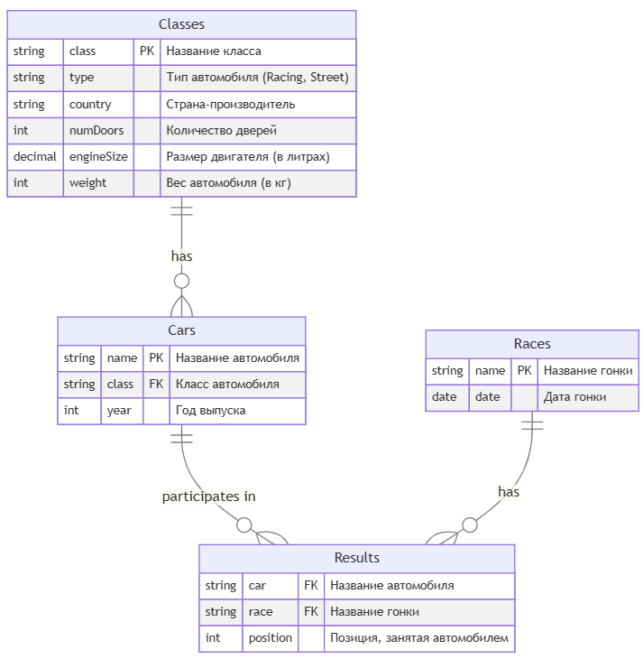

# Схема базы данных автомобильных гонок



---

# Скрипты создания таблиц

### Таблица `classes`
```sql
create table classes (
    class       varchar(100)    not null,
    type        varchar(20)     not null check (type in ('racing', 'street')), -- тип класса
    country     varchar(100)    not null,
    numdoors    int             not null,
    enginesize  decimal(3, 1)   not null, -- размер двигателя в литрах
    weight      int             not null, -- вес автомобиля в килограммах
    primary key (class)
);
```

### Таблица `cars`
```sql
create table cars (
    name    varchar(100)    not null,
    class   varchar(100)    not null,
    year    int             not null,
    primary key (name),
    foreign key (class) references classes(class)
);
```

### Таблица `races`
```sql
create table races (
    name    varchar(100)    not null,
    date    date            not null,
    primary key (name)
);
```

### Таблица `results`
```sql
create table results (
    car         varchar(100)    not null,
    race        varchar(100)    not null,
    position    int             not null,
    primary key (car, race),
    foreign key (car) references cars(name),
    foreign key (race) references races(name)
);
```

---

# Скрипты наполнения данными

### Данные для таблицы `classes`
```sql
insert into classes (class, type, country, numdoors, enginesize, weight)
values ('sportscar', 'racing', 'usa', 2, 3.5, 1500),
       ('sedan', 'street', 'germany', 4, 2.0, 1200),
       ('suv', 'street', 'japan', 4, 2.5, 1800),
       ('hatchback', 'street', 'france', 5, 1.6, 1100),
       ('convertible', 'racing', 'italy', 2, 3.0, 1300),
       ('coupe', 'street', 'usa', 2, 2.5, 1400),
       ('luxury sedan', 'street', 'germany', 4, 3.0, 1600),
       ('pickup', 'street', 'usa', 2, 2.8, 2000);
```

### Данные для таблицы `cars`
```sql
insert into cars (name, class, year)
values ('ford mustang', 'sportscar', 2020),
       ('bmw 3 series', 'sedan', 2019),
       ('toyota rav4', 'suv', 2021),
       ('renault clio', 'hatchback', 2020),
       ('ferrari 488', 'convertible', 2019),
       ('chevrolet camaro', 'coupe', 2021),
       ('mercedes-benz s-class', 'luxury sedan', 2022),
       ('ford f-150', 'pickup', 2021),
       ('audi a4', 'sedan', 2018),
       ('nissan rogue', 'suv', 2020);
```

### Данные для таблицы `races`
```sql
insert into races (name, date)
values ('indy 500', '2023-05-28'),
       ('le mans', '2023-06-10'),
       ('monaco grand prix', '2023-05-28'),
       ('daytona 500', '2023-02-19'),
       ('spa 24 hours', '2023-07-29'),
       ('bathurst 1000', '2023-10-08'),
       ('nürburgring 24 hours', '2023-06-17'),
       ('pikes peak international hill climb', '2023-06-25');
```

### Данные для таблицы `results`
```sql
insert into results (car, race, position)
values ('ford mustang', 'indy 500', 1),
       ('bmw 3 series', 'le mans', 3),
       ('toyota rav4', 'monaco grand prix', 2),
       ('renault clio', 'daytona 500', 5),
       ('ferrari 488', 'le mans', 1),
       ('chevrolet camaro', 'monaco grand prix', 4),
       ('mercedes-benz s-class', 'spa 24 hours', 2),
       ('ford f-150', 'bathurst 1000', 6),
       ('audi a4', 'nürburgring 24 hours', 8),
       ('nissan rogue', 'pikes peak international hill climb', 3);
```

---

# Задачи для решения

* [задача 1](./tasks/task-1.md)
* [задача 2](./tasks/task-2.md)
* [задача 3](./tasks/task-3.md)
* [задача 4](./tasks/task-4.md)
* [задача 5](./tasks/task-5.md)
